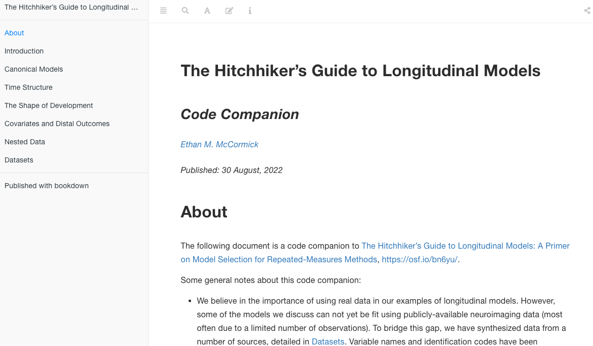

<!-- README.md is generated from README.qmd. Please edit that file -->

# The Hitchhiker’s Guide to Longitudinal Models: A Primer on Model Selection for Repeated-Measures Methods

[Ethan M. McCormick](https://e-m-mccormick.github.io/) \| Department of
Methodology & Statistics \| Leiden University

[Michelle L.
Byrne](https://research.monash.edu/en/persons/michelle-byrne) \| Turner
Institute for Brain and Mental Health \| Monash University

[John C. Flournoy](https://johnflournoy.science/) \| Department of
Psychology \| Harvard University

[Kathryn L. Mills](http://devbrainlab.org/) \| Department of Psychology
\| University of Oregon

[Jennifer H. Pfeifer](https://dsn.uoregon.edu/) \| Department of
Psychology \| University of Oregon

------------------------------------------------------------------------

> Ethan M. McCormick, Michelle L. Byrne, John C. Flournoy, Kathryn L.
> Mills, & Jennifer H. Pfeifer. 2022. [“The Hitchhiker’s Guide to
> Longitudinal Models: A Primer on Model Selection for Repeated-Measures
> Methods,”](https://doi.org/10.31234/osf.io/ga4qz) *preprint*.
> PsyArXiv.

------------------------------------------------------------------------

## Abstract

Longitudinal data are becoming increasingly available in developmental
neuroimaging. To maximize the promise of this wealth of information on
how biology, behavior, and cognition change over time, there is a need
to incorporate broad and rigorous training in longitudinal methods into
the repertoire of developmental neuroscientists. Fortunately, these
models have an incredibly rich tradition in the broader developmental
sciences that we can draw from. Here, we provide a primer on
longitudinal models, written in a beginner-friendly (and slightly
irreverent) manner, with a particular focus on selecting among different
modeling frameworks (e.g., multilevel versus latent curve models) to
build the theoretical model of development a researcher wishes to test.
Our aims are three-fold: 1) lay out a heuristic framework for
longitudinal model selection, 2) build a repository of references that
ground each model in its tradition of methodological development and
practical implementation with a focus on connecting researchers to
resources outside traditional neuroimaging journals, and 3) provide
practical resources in the form of a codebook companion demonstrating
how to fit these models. These resources together aim to enhance
training for the next generation of developmental neuroscientists by
providing a solid foundation for future forays into advanced modeling
applications.

------------------------------------------------------------------------

## Codebook Companion

Code examples and additional information/explanations can be found
[here](https://e-m-mccormick.github.io/static/longitudinal-primer/index.html).

------------------------------------------------------------------------

## Licenses

**Text and figures:** All text and images are licensed under Creative
Commons ([CC-BY-4.0](http://creativecommons.org/licenses/by/4.0/))

**Code:** All code is licensed under the [MIT License](LICENSE.md).
